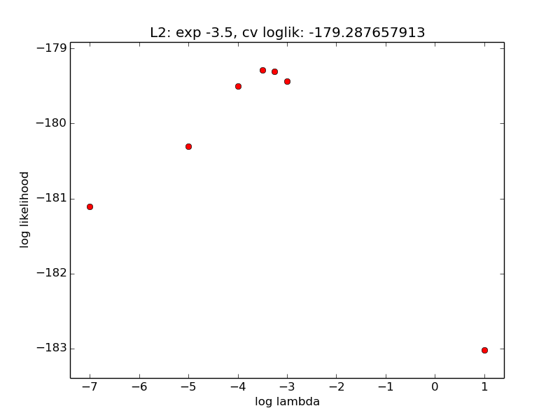
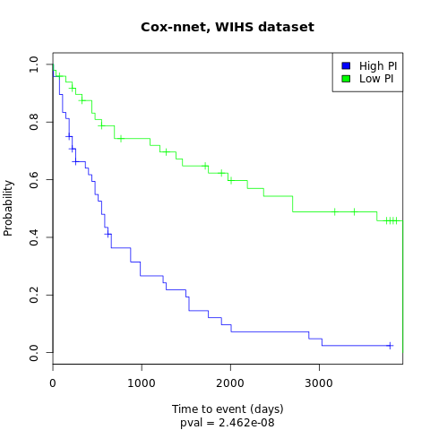

# cox-nnet

This is a package for building a model using the neural network extension of Cox regression.  


Classes: 
* **CoxRegression** - the Cox regression output layer
* **HiddenLayer** - hidden layers between input and output, based on deeplearning.net/tutorial/code/mlp.py
* **CoxMlp** - container class for output layer and hidden layers

Functions:
* **createSharedDataset** - helper function to create shared dataset in theano
* **trainCoxMlp** - main function for training a cox-nnet model
* **predictNewData** - function for predicting new data
* **L2CVSearch** - helper function for performing cross-validation to select optimal L2 parameter
* **CVLoglikelihood** - calculates the cross validation likelihood (Houwelingen et al. 2005)
* **varImportance** - calculates variable importance (Fischer 2015)
* **saveModel** - saves a model to a file: saveModel(model, file_name)
* **loadModel** - loads model from file: loadModel(fileName)


## Requirements and installation
This package relies on `numpy`, `sklearn`, `matplotlib` and `theano`. Please install these packages first.  

To install cox-nnet,

````
sudo pip install cox-nnet
````

## Usage 

This is an example using breast cancer microarray data as an example.  This can be run interactively using idle or ipython, but would take a long time.  To run this using multiple threads, run `OMP_NUM_THREADS=4 python example.py` (where e.g. 4 is the number of cores you have available).  

````python
from cox_nnet import *
import numpy
import matplotlib.pyplot as plt

#training data (80%)
x_train = numpy.loadtxt(open("WIHS/x_train.csv","rb"),delimiter=",",skiprows=0)
ytime_train = numpy.loadtxt(open("WIHS/ytime_train.csv","rb"),delimiter=",",skiprows=0)
ystatus_train = numpy.loadtxt(open("WIHS/ystatus_train.csv","rb"),delimiter=",",skiprows=0)

#test data (20% holdout)
x_test = numpy.loadtxt(open("WIHS/x_test.csv","rb"),delimiter=",",skiprows=0)
ytime_test = numpy.loadtxt(open("WIHS/ytime_test.csv","rb"),delimiter=",",skiprows=0)
ystatus_test = numpy.loadtxt(open("WIHS/ystatus_test.csv","rb"),delimiter=",",skiprows=0)

````

Cross validate to determine regularization parameter:

````python

#model parameters
N_train = ytime_train.shape[0] #number of training examples
n_in = x_train.shape[1] #number of features
n_hidden = [n_in ** 0.5] #array of number of hidden nodes in each hidden layer

#training parameters
max_iter = 10000 #Maximum number of iterations
stop_threshold = 0.995 #factor for considering new best cost
patience = 2000 #minimum number of iterations
patience_incr = 2 #number of minimum iterations to increase every time a new best is found (i.e., 2 * current_iteration)
L1_reg = 0 #L1 regularization parameter
learning_rate = 0.01 #Starting learning rate
n_folds = 5 #Folds for cross validation

#cross validate training set to determine lambda parameter
cv_likelihoods, L2_reg_params, mean_cvpl = L2CVSearch2(x_train = x_train, ytime_train = ytime_train, ystatus_train = ystatus_train, n_hidden = n_hidden, learning_rate=learning_rate, max_iter=max_iter, stop_threshold=stop_threshold, patience=patience, patience_incr=patience_incr, rand_seed=123, cv_seed=1, n_folds=n_folds)

L2_reg = L2_reg_params[numpy.argmax(avg_cv)]

plt.plot(L2_reg_params, mean_cvpl, 'ro')
plt.title("L2: " + str(L2_reg) + ", cv loglik: " + str(cvpl))
plt.xlabel("log lambda")
plt.ylabel("log likelihood")
plt.margins(0.05, 0.1)
plt.savefig("log_likelihoods.png")

````


Predict test data:
````python
model, cost_iter = trainCoxMlp(x_train = x_train, ytime_train = ytime_train, ystatus_train = ystatus_train, L1_reg = L1_reg, L2_reg = L2_reg, n_hidden = n_hidden, learning_rate=learning_rate, max_iter=max_iter, stop_threshold=stop_threshold, patience=patience, patience_incr=patience_incr)

theta = predictNewData(model, x_test, ytime_test, ystatus_test)
numpy.savetxt("theta.csv", theta, delimiter=",")
````


Plot using R survival package:
```R
Rscript WIHS_plots.r
```

